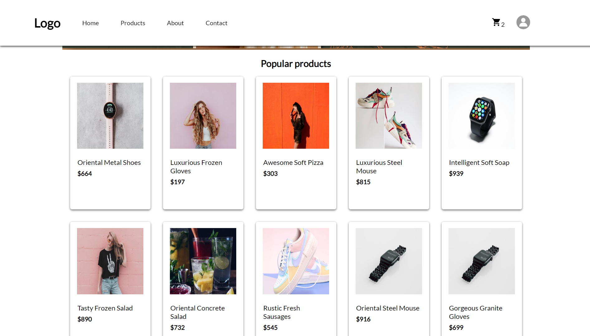
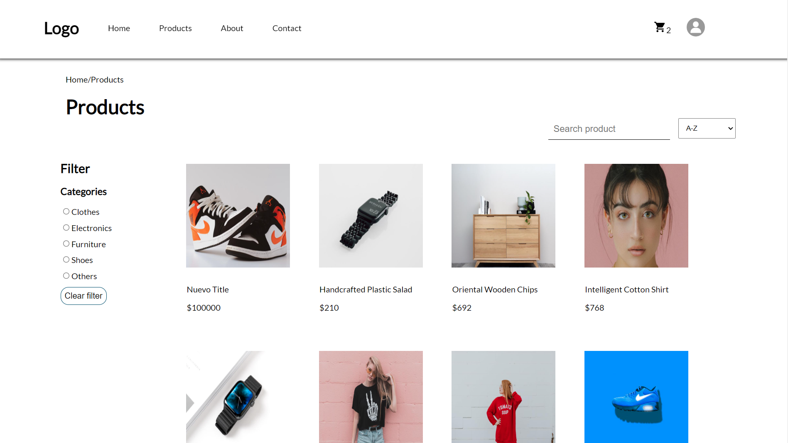
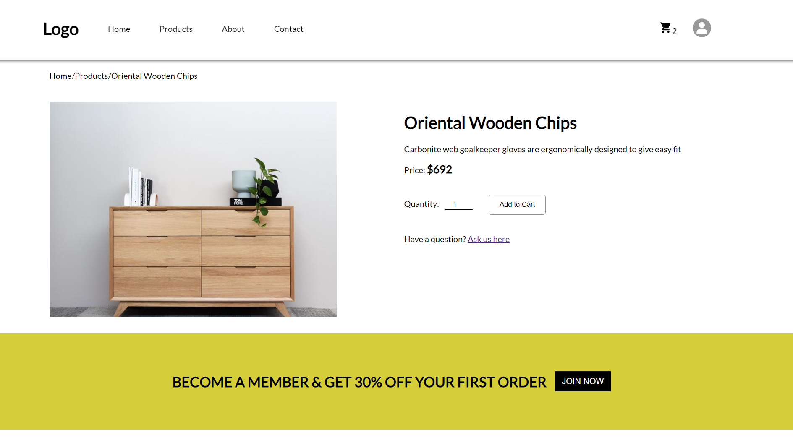
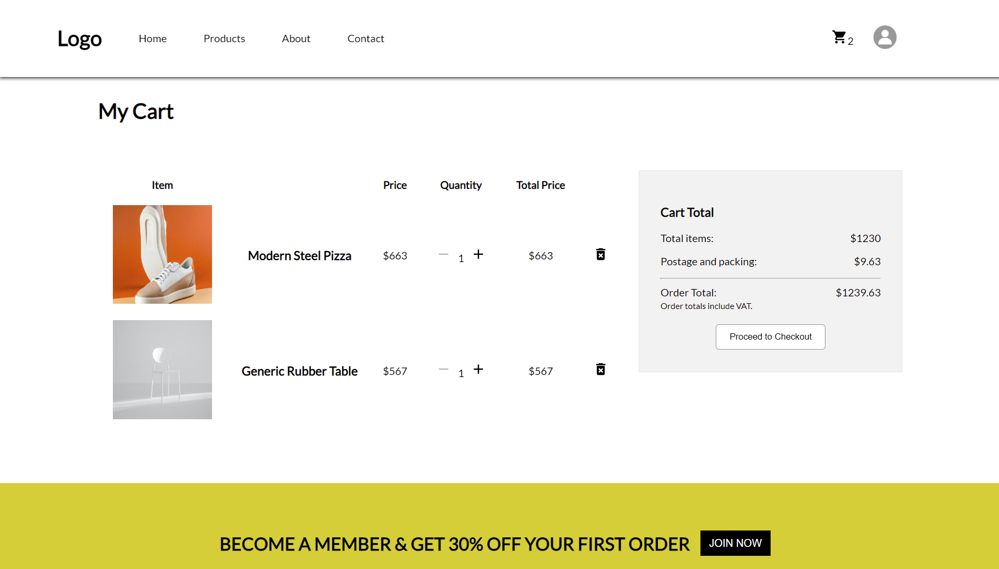
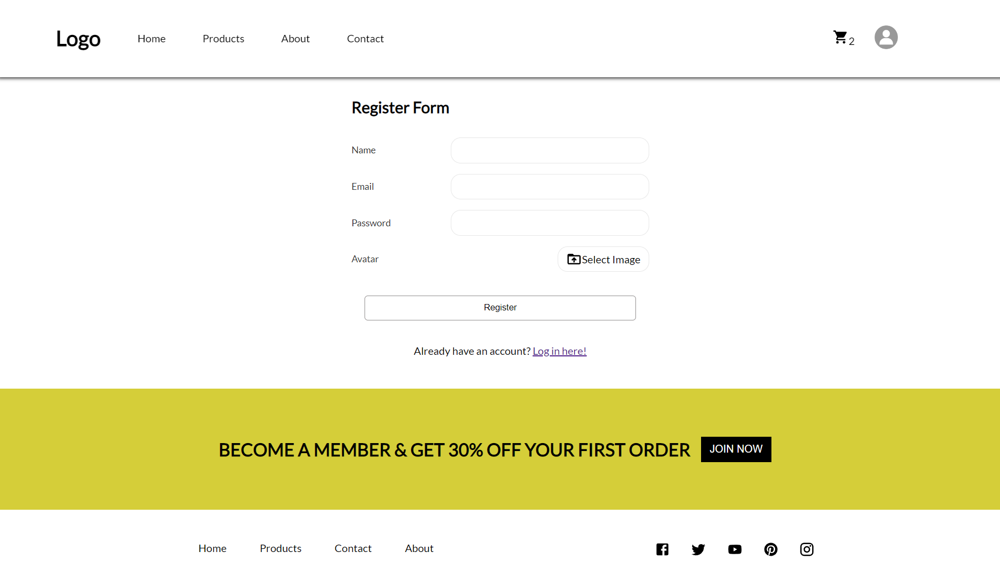

# Front-end Project


## Description

A basic e-commerce website is built with React, Redux toolkit, TypeScript, SASS, React Router. The website has a shopping home page, product details page, and a checkout page. It's also have the Log In and Register function for user. The data for the website is fetched from the [Platzi Fake Store API](https://fakeapi.platzi.com/).

## Installation

Clone the repository by command `git clone`
Then `npm install` to install all the dependencies
Start the project with `npm start`

## Project Structure

```bash
│
├───public
│       index.html
│
└───src
    │   App.tsx
    │   index.tsx
    │   react-app-env.d.ts
    │   reportWebVitals.ts
    │   setupTests.ts
    │
    ├───assets
    │   ├───images
    │   │       avatar.jpg
    │   │       clothes.jpg
    │   │       home-pic-1.png
    │   │       home-pic.jpg
    │   │       slide-pic.jpg
    │   │
    │   └───styles
    │       │   main.scss
    │       │
    │       ├───abstracts
    │       │   │   _mixins.scss
    │       │   │
    │       │   └───variables
    │       │           _colors.scss
    │       │           _fonts.scss
    │       │
    │       └───sections
    │           ├───components
    │           │       _carousel.scss
    │           │       _editProduct.scss
    │           │       _footer.scss
    │           │       _navbar.scss
    │           │       _pagination.scss
    │           │       _promoSlide.scss
    │           │
    │           └───pages
    │                   _cart.scss
    │                   _createProduct.scss
    │                   _login.scss
    │                   _productList.scss
    │                   _profile.scss
    │                   _register.scss
    │                   _singleProduct.scss
    │
    ├───common
    │       axiosInstance.ts
    │
    ├───components
    │       Carousel.tsx
    │       EditProduct.tsx
    │       Footer.tsx
    │       Navbar.tsx
    │       Pagination.tsx
    │       PromoSlide.tsx
    │
    ├───hooks
    │       reduxHook.ts
    │
    ├───pages
    │       AboutPage.tsx
    │       CartPage.tsx
    │       ContactPage.tsx
    │       CreateProductForm.tsx
    │       HomePage.tsx
    │       LoginForm.tsx
    │       ProductsListPage.tsx
    │       Profile.tsx
    │       RegisterForm.tsx
    │       SingleProductPage.tsx
    │
    ├───redux
    │   │   store.ts
    │   │
    │   └───reducers
    │           cartReducer.ts
    │           categoryReducer.ts
    │           productReducer.ts
    │           userReducer.ts
    │
    ├───test
    │   ├───reducers
    │   │       products.test.ts
    │   │       user.test.ts
    │   │
    │   └───shared
    │           server.ts
    │
    └───types
            cart.ts
            category.ts
            pagination.ts
            product.ts
            user.ts

```

## Pictures Demo






